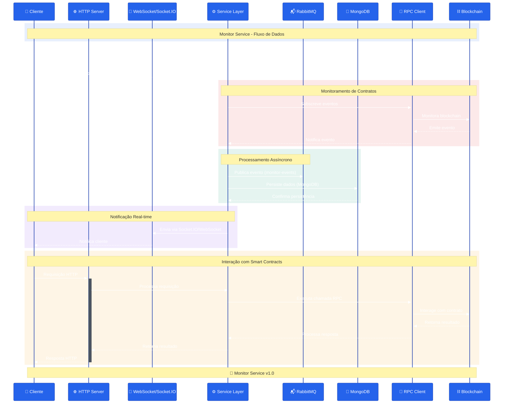

```mermaid
%%{init: { 
    'theme': 'base',
    'themeVariables': {
        'primaryColor': '#2563eb',
        'primaryTextColor': '#ffffff',
        'primaryBorderColor': '#1e40af',
        'lineColor': '#2563eb',
        'secondaryColor': '#4b5563',
        'tertiaryColor': '#ffffff'
    }
}}%%
sequenceDiagram
    participant Client as 👤 Cliente
    participant HTTP as 🌐 HTTP Server
    participant WS as 📡 WebSocket/Socket.IO
    participant Service as ⚙️ Service Layer
    participant Queue as 📬 RabbitMQ
    participant DB as 💾 MongoDB
    participant RPC as 🔗 RPC Client
    participant BC as ⛓️ Blockchain

    %% Estilo
    rect rgba(37, 99, 235, 0.1)
        Note over Client,BC: Monitor Service - Fluxo de Dados
    end

    %% Inicialização do Sistema
    Client->>+HTTP: Requisição HTTP
    HTTP->>WS: Upgrade para WebSocket
    WS-->>Client: Conexão estabelecida

    %% Monitoramento de Eventos
    rect rgba(220, 38, 38, 0.1)
        Note over Service,BC: Monitoramento de Contratos
        Service->>+RPC: Subscreve eventos
        RPC->>BC: Monitora blockchain
        BC-->>RPC: Emite evento
        RPC-->>Service: Notifica evento
    end

    %% Processamento de Eventos
    rect rgba(5, 150, 105, 0.1)
        Note over Service,Queue: Processamento Assíncrono
        Service->>Queue: Publica evento (monitor-events)
        Service->>DB: Persiste dados (MongoDB)
        DB-->>Service: Confirma persistência
    end

    %% Notificação ao Cliente
    rect rgba(124, 58, 237, 0.1)
        Note over Service,Client: Notificação Real-time
        Service->>WS: Envia via Socket.IO/WebSocket
        WS-->>Client: Notifica cliente
    end

    %% Interação com Contratos
    rect rgba(245, 158, 11, 0.1)
        Note over Client,BC: Interação com Smart Contracts
        Client->>+HTTP: Requisição HTTP
        HTTP->>Service: Processa requisição
        Service->>RPC: Executa chamada RPC
        RPC->>BC: Interage com contrato
        BC-->>RPC: Retorna resultado
        RPC-->>Service: Processa resposta
        Service-->>HTTP: Retorna resultado
        HTTP-->>-Client: Resposta HTTP
    end

    %% Legenda
    Note over Client,BC: 🔄 Monitor Service v1.0
``` 