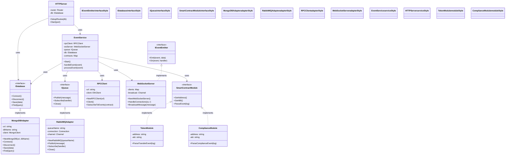

```mermaid
classDiagram
    %% Interfaces principais
    class IEventEmitter {
        <<interface>>
        +Emit(event, data)
        +On(event, handler)
    }

    class IDatabase {
        <<interface>>
        +Connect()
        +Disconnect()
        +Save(data)
        +Find(query)
    }

    class IQueue {
        <<interface>>
        +Publish(message)
        +Subscribe(handler)
        +Close()
    }

    %% Classes concretas - Adaptadores
    class MongoDBAdapter {
        -uri: string
        -dbName: string
        -client: MongoClient
        +NewMongoDB(uri, dbName)
        +Connect()
        +Disconnect()
        +Save(data)
        +Find(query)
    }

    class RabbitMQAdapter {
        -queueName: string
        -connection: Connection
        -channel: Channel
        +NewRabbitMQ(queueName)
        +Publish(message)
        +Subscribe(handler)
        +Close()
    }

    class RPCClient {
        -url: string
        -client: EthClient
        +NewRPCClient(url)
        +Client()
        +SubscribeToEvents(contract)
    }

    class WebSocketServer {
        -clients: Map
        -broadcast: Channel
        +NewWebSocketServer()
        +HandleConnections(w, r)
        +BroadcastMessage(message)
    }

    %% Classes de Serviço
    class EventService {
        -rpcClient: RPCClient
        -wsServer: WebSocketServer
        -queue: IQueue
        -db: IDatabase
        -contracts: Map
        +Start()
        -handleEvent(event)
        -processEvent(event)
    }

    class HTTPServer {
        -router: Router
        -db: IDatabase
        +SetupRoutes(db)
        +Start(port)
    }

    %% Módulos de Contrato
    class SmartContractModule {
        <<interface>>
        +GetAddress()
        +GetABI()
        +ParseEvent(log)
    }

    class TokenModule {
        -address: string
        -abi: string
        +ParseTransferEvent(log)
    }

    class ComplianceModule {
        -address: string
        -abi: string
        +ParseComplianceEvent(log)
    }

    %% Relações
    IDatabase <|.. MongoDBAdapter : implements
    IQueue <|.. RabbitMQAdapter : implements
    IEventEmitter <|.. WebSocketServer : implements
    SmartContractModule <|.. TokenModule : implements
    SmartContractModule <|.. ComplianceModule : implements

    EventService --> IQueue : uses
    EventService --> IDatabase : uses
    EventService --> RPCClient : uses
    EventService --> WebSocketServer : uses
    EventService --> SmartContractModule : uses

    HTTPServer --> IDatabase : uses
    HTTPServer --> EventService : uses

    %% Estilização
    classDef interfaceStyle fill:#e3f2fd,stroke:#2196f3,stroke-width:2px
    classDef adapterStyle fill:#fff3e0,stroke:#ff9800,stroke-width:2px
    classDef serviceStyle fill:#e8f5e9,stroke:#4caf50,stroke-width:2px
    classDef moduleStyle fill:#f3e5f5,stroke:#9c27b0,stroke-width:2px

    class IEventEmitter interfaceStyle
    class IDatabase interfaceStyle
    class IQueue interfaceStyle
    class SmartContractModule interfaceStyle

    class MongoDBAdapter adapterStyle
    class RabbitMQAdapter adapterStyle
    class RPCClient adapterStyle
    class WebSocketServer adapterStyle

    class EventService serviceStyle
    class HTTPServer serviceStyle

    class TokenModule moduleStyle
    class ComplianceModule moduleStyle
``` 