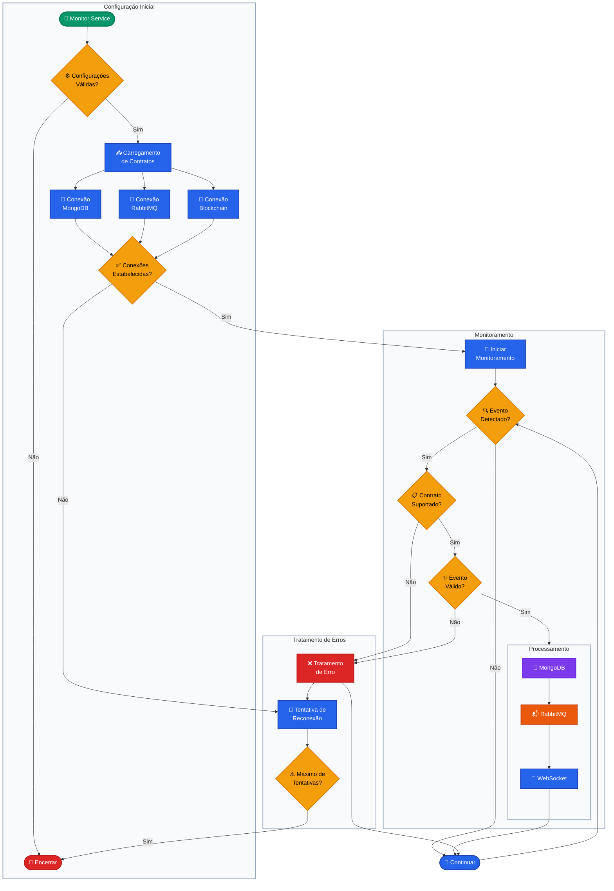

```mermaid
flowchart TB
    %% Definição de Estilos
    classDef primary fill:#2563eb,stroke:#1e40af,stroke-width:2px,color:#fff
    classDef success fill:#059669,stroke:#047857,stroke-width:2px,color:#fff
    classDef danger fill:#dc2626,stroke:#b91c1c,stroke-width:2px,color:#fff
    classDef warning fill:#f59e0b,stroke:#d97706,stroke-width:2px,color:#000
    classDef info fill:#7c3aed,stroke:#6d28d9,stroke-width:2px,color:#fff
    classDef queue fill:#ea580c,stroke:#c2410c,stroke-width:2px,color:#fff
    
    %% Definição dos Nós
    Start([🚀 Monitor Service]):::success
    Config{"⚙️ Configurações<br/>Válidas?"}:::warning
    LoadConfig["📥 Carregamento<br/>de Contratos"]:::primary
    InitDB["🔌 Conexão<br/>MongoDB"]:::primary
    InitQueue["🔌 Conexão<br/>RabbitMQ"]:::primary
    InitRPC["🔌 Conexão<br/>Blockchain"]:::primary
    
    ConnCheck{"✅ Conexões<br/>Estabelecidas?"}:::warning
    Monitor["📡 Iniciar<br/>Monitoramento"]:::primary
    
    EventCheck{"🔍 Evento<br/>Detectado?"}:::warning
    ContractCheck{"📋 Contrato<br/>Suportado?"}:::warning
    ValidEvent{"✨ Evento<br/>Válido?"}:::warning
    
    DB["💾 MongoDB"]:::info
    MQ["📬 RabbitMQ"]:::queue
    WS["📱 WebSocket"]:::primary
    
    Error["❌ Tratamento<br/>de Erro"]:::danger
    Retry["🔄 Tentativa de<br/>Reconexão"]:::primary
    MaxRetry{"⚠️ Máximo de<br/>Tentativas?"}:::warning
    
    Loop([🔄 Continuar]):::primary
    Finish([🛑 Encerrar]):::danger

    subgraph Init ["Configuração Inicial"]
        Start --> Config
        Config -->|Não| Finish
        Config -->|Sim| LoadConfig
        LoadConfig --> InitDB & InitQueue & InitRPC
        InitDB & InitQueue & InitRPC --> ConnCheck
    end
    
    subgraph Watch ["Monitoramento"]
        Monitor --> EventCheck
        EventCheck -->|Sim| ContractCheck
        ContractCheck -->|Sim| ValidEvent
        ValidEvent -->|Sim| Process
    end
    
    subgraph Process ["Processamento"]
        direction LR
        DB --> MQ --> WS
    end
    
    subgraph ErrorHandling ["Tratamento de Erros"]
        Error --> Retry
        Retry --> MaxRetry
        MaxRetry -->|Sim| Finish
    end
    
    %% Conexões entre Subgráficos
    ConnCheck -->|Sim| Monitor
    ConnCheck -->|Não| Retry
    
    EventCheck -->|Não| Loop
    Loop --> EventCheck
    
    ContractCheck -->|Não| Error
    ValidEvent -->|Não| Error
    
    WS --> Loop
    Error --> Loop

    %% Estilo dos Subgráficos
    style Init fill:#f8fafc,stroke:#94a3b8,stroke-width:2px
    style Watch fill:#f8fafc,stroke:#94a3b8,stroke-width:2px
    style Process fill:#f8fafc,stroke:#94a3b8,stroke-width:2px
    style ErrorHandling fill:#f8fafc,stroke:#94a3b8,stroke-width:2px
``` 